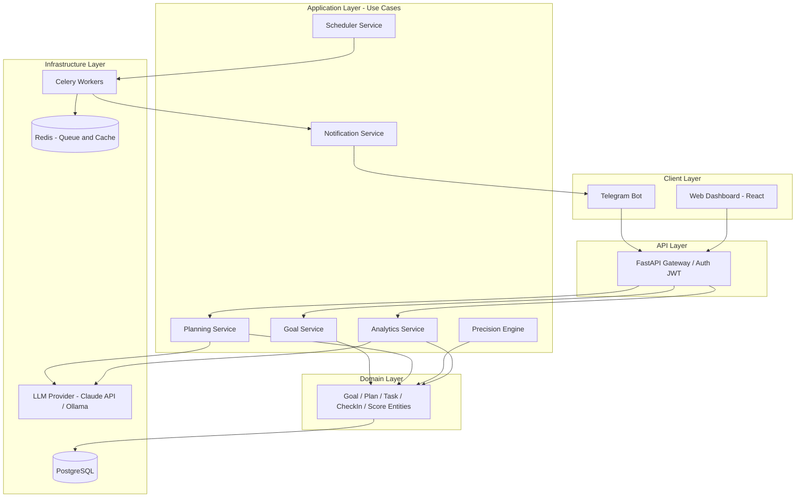
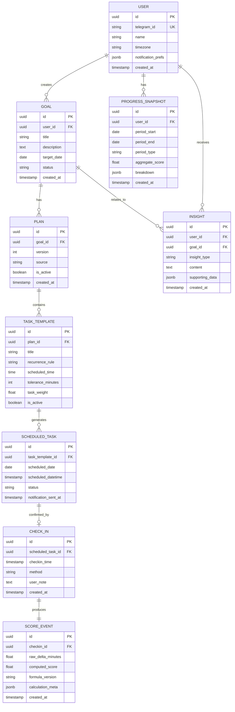
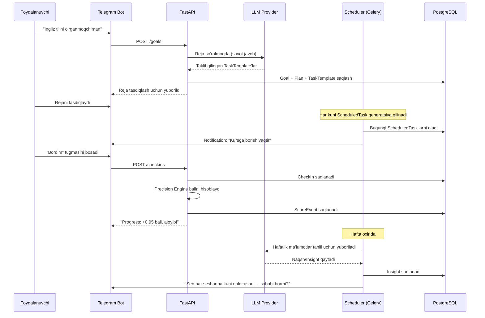

 Disipl (working name) — AI-Powered Personal Discipline & Goal Execution System
 
> "Sizga yo'l ko'rsatuvchi emas, sizni **nazorat qiluvchi** shaxsiy kotib."
 
Bu hujjat loyihaning to'liq texnik arxitekturasi, ma'lumotlar bazasi sxemasi, Clean Architecture asosidagi kod tuzilishi va MVP'dan to to'liq SaaS'gacha bo'lgan yo'l xaritasini tavsiflaydi.
 
---
 
## 1. Muammo va Vizyon
 
### 1.1 Muammo
 
Odamlar maqsad qo'yishadi ("ingliz tilini o'rganaman", "sportga boraman", "loyihamni tugataman"), lekin ular quyidagi 3 bosqichda muvaffaqiyatsizlikka uchraydi:
 
1. **Reja yo'q** — maqsad bor, lekin uni kunlik/haftalik bajariladigan qadamlarga bo'la olmaydi
2. **Nazorat yo'q** — reja bor, lekin uni bajarish yoki bajarmaslikni hech kim (hech narsa) qattiq kuzatmaydi; o'zini-o'zi aldash (self-deception) juda oson
3. **Aql-idrok yo'q** — hatto kuzatuv bo'lsa ham (masalan oddiy habit-tracker), u faqat "qildim/qilmadim" belgilaydi — **nima uchun** qilmaganini, qaysi kun/vaqt/sharoitda muvaffaqiyatsiz bo'lishini tahlil qilmaydi
Mavjud yechimlar (Habitica, Beeminder, oddiy todo ilovalar) bu uchtasidan birini yoki ikkitasini qamrab oladi, lekin hech biri **vaqt aniqligi + AI-driven reja + AI-driven tahlil** uchligini birga taklif qilmaydi.
 
### 1.2 Vizyon
 
Tizim foydalanuvchi uchun 3 ta rolni bajaradi:
 
| Rol | Vazifa |
|---|---|
| **Rejachi (Planner)** | Maqsadni aniq, vaqt-bog'liq qadamlarga bo'ladi (agar foydalanuvchi bilmasa — AI tuzadi) |
| **Nazoratchi (Enforcer)** | Har bir qadamning bajarilish vaqtini aniq kuzatadi, kechikish/erta bajarishni o'lchaydi, progress ballini shafqatsiz hisoblaydi |
| **Tahlilchi (Analyst)** | Vaqt o'tishi bilan naqshlarni topadi ("sen har seshanba kuni muvaffaqiyatsiz bo'lasan"), sababini so'raydi, tavsiya beradi |
 
**Muhim tamoyil:** Bu mahsulot **qattiq** bo'lishi kerak. Yumshoq, "hammasi joyida bo'ladi" degan ilovalar allaqachon ko'p. Bizning farqimiz — foydalanuvchi buni bila turib tanlaydi, chunki og'riq — mahsulotning qiymat taklifining bir qismi.
 
---
 
## 2. Core Domain Concepts (Clean Architecture — Entities)
 
Clean Architecture tamoyiliga ko'ra, domain (biznes logika) hech qanday freymvork yoki bazaga bog'liq bo'lmasligi kerak. Quyida asosiy domain obyektlari:
 
```
Goal (Maqsad)
 └── Plan (Reja) — Goal'ga tegishli, AI yoki foydalanuvchi tomonidan yaratiladi
      └── TaskTemplate (Vazifa shabloni) — takrorlanuvchi vazifa ta'rifi
           └── ScheduledTask (Rejalashtirilgan vazifa) — TaskTemplate'ning aniq sana/vaqtdagi nusxasi
                └── CheckIn (Bajarilish tasdig'i) — foydalanuvchi bot orqali "bajardim" deb belgilashi
                     └── ScoreEvent (Ball hodisasi) — Precision Engine natijasi
 
ProgressSnapshot (Progress ko'rinishi) — kunlik/haftalik yig'ma hisobot
Insight (Tushuncha) — LLM tomonidan topilgan naqsh/tavsiya
```
 
### 2.1 Nega bunday bo'linish kerak
 
- **Goal → Plan** ajratilgan, chunki bir maqsadning rejasi vaqt o'tishi bilan o'zgarishi mumkin (versiyalash uchun)
- **TaskTemplate → ScheduledTask** ajratilgan, chunki shablon takrorlanadi ("har kuni soat 14:30"), lekin har bir kunlik nusxa o'zining holati (bajarildi/bajarilmadi/kechikdi) bilan mustaqil obyekt
- **ScoreEvent** alohida, chunki ball hisoblash formulasi vaqt o'tishi bilan o'zgarishi mumkin — tarixiy ballarni qayta hisoblamasdan, har bir hodisa o'zgarmas (immutable) log sifatida saqlanadi
---
 
## 3. Precision Scoring Engine — Tizimning Yuragi
 
Bu tizimning eng muhim va eng nozik qismi. Formula quyidagi tamoyillarga asoslanadi:
 
### 3.1 Kirish parametrlari
 
- `scheduled_time` — vazifa uchun belgilangan vaqt
- `tolerance_window` — foydalanuvchi belgilagan tolerantlik oralig'i (masalan ±10 daqiqa = "o'z vaqtida" hisoblanadi)
- `checkin_time` — foydalanuvchi haqiqatda tasdiqlagan vaqt
- `task_weight` — vazifaning umumiy reja ichidagi og'irligi (0.0–1.0)
### 3.2 Formula mantig'i (psevdokod)
 
```python
def calculate_score(scheduled_time, checkin_time, tolerance_minutes, task_weight):
    delta_minutes = (checkin_time - scheduled_time).total_seconds() / 60
 
    if abs(delta_minutes) <= tolerance_minutes:
        # O'z vaqtida — to'liq ball
        return 1.0 * task_weight
 
    elif delta_minutes > tolerance_minutes:
        # Kech qolgan — eksponensial jazo
        # 10 daqiqa kech va 2 soat kech BIR XIL emas
        lateness = delta_minutes - tolerance_minutes
        penalty = 1 - exp(-DECAY_CONST * lateness)
        return max(0, (1 - penalty)) * task_weight
 
    else:
        # Erta bajargan
        earliness = tolerance_minutes - abs(delta_minutes)
        # Erta bajarish qisman ijobiy, lekin haddan tashqari erta
        # ("shoshilinch/sun'iy bajarilgan" belgisi) uchun bonus cheklanadi
        bonus_cap = 0.15  # maksimal +15% bonus
        bonus = min(bonus_cap, earliness * EARLY_BONUS_RATE)
        return min(1.0, 1.0 + bonus) * task_weight
```
 
### 3.3 Muhim dizayn qarorlari
 
| Qaror | Sabab |
|---|---|
| Kechikish jazosi **eksponensial**, chiziqli emas | Kichik kechikishlarni shafqatsiz jazolamaslik, lekin katta kechikishlarni keskin pasaytirish |
| Erta bajarish uchun bonus **cheklangan** (max +15%) | Haddan tashqari erta bajarish ko'pincha "check-box uchun bajarish", sifatsiz bajarilish belgisi bo'lishi mumkin |
| Har bir `ScoreEvent` alohida saqlanadi, umumiy ball undan **hisoblanadi**, saqlanmaydi | Formula o'zgarsa, tarixni qayta hisoblash imkoniyati (auditable, WillTrack loyihasidagi "domain events" tamoyili bilan bir xil) |
| `task_weight` reja darajasida sozlanadi | Barcha vazifalar bir xil muhim emas — "50 so'z yodlash" va "kursga borish" bir xil og'irlikda bo'lmasligi kerak |
 
### 3.4 Xavf — demotivatsiya balansi
 
Bu formula A/B testlanishi shart. Tavsiya: MVP bosqichida `DECAY_CONST` va `EARLY_BONUS_RATE` ni **admin darajasida sozlanadigan** qilib qo'yish (hardcode emas, config/DB orqali), chunki real foydalanuvchi ma'lumotlarisiz to'g'ri qiymatni oldindan bilib bo'lmaydi.
 
---
 
## 4. Tizim Arxitekturasi (High-Level)
 

 
### 4.1 Qatlamlar tavsifi (Clean Architecture)
 
```
src/
├── domain/                    # Freymvorkdan mustaqil, sof biznes logika
│   ├── entities/               # Goal, Plan, TaskTemplate, ScheduledTask, CheckIn, ScoreEvent
│   ├── value_objects/          # TimeWindow, ScoreFormula, ToleranceRange
│   └── exceptions/             # DomainException lar (masalan InvalidScheduleException)
│
├── application/                # Use case'lar — domain va infratuzilma orasidagi orkestratsiya
│   ├── use_cases/
│   │   ├── create_goal.py
│   │   ├── generate_plan_with_ai.py
│   │   ├── process_checkin.py
│   │   ├── calculate_score.py
│   │   └── generate_weekly_insight.py
│   └── interfaces/             # Portlar (abstract): IGoalRepository, ILLMProvider, INotifier
│
├── infrastructure/              # Tashqi dunyo bilan integratsiya (portlarni implement qiladi)
│   ├── db/
│   │   ├── models/              # SQLAlchemy modellar
│   │   └── repositories/        # IGoalRepository implementatsiyasi
│   ├── llm/
│   │   ├── claude_provider.py
│   │   └── ollama_provider.py
│   ├── telegram/
│   │   └── bot_handlers.py
│   └── scheduler/
│       └── celery_tasks.py
│
├── presentation/                 # API qatlami
│   ├── api/
│   │   ├── v1/
│   │   │   ├── goals.py
│   │   │   ├── plans.py
│   │   │   ├── checkins.py
│   │   │   └── insights.py
│   │   └── dependencies.py       # DI - dependency injection
│   └── schemas/                  # Pydantic request/response modellar
│
└── config/
    ├── settings.py
    └── di_container.py           # Dependency Injection konteyneri
```
 
**Nega bu muhim:** `domain/` qatlami hech qachon `infrastructure/`ni import qilmaydi. Bu — LLM provayderni (Claude'dan Ollama'ga) yoki bazani (Postgres'dan boshqasiga) almashtirish domain logikasiga tegmasdan mumkin bo'lishini ta'minlaydi. Bu ayniqsa muhim, chunki loyiha o'sishi bilan turli LLM provayderlarni sinab ko'rish kerak bo'ladi (narx/sifat balansi uchun).
 
---
 
## 5. Ma'lumotlar Bazasi Sxemasi
 

 
### 5.1 Muhim dizayn qarorlari
 
- **`SCORE_EVENT.formula_version`** — formula o'zgarganda eski hodisalar buzilmasligi uchun versiyalash
- **`CHECK_IN` va `SCORE_EVENT` ajratilgan** — check-in "fakt" (odam nima qilgani), score "talqin" (fakt asosida hisoblangan natija). Bu ajratish keyinchalik formula qayta hisoblash imkonini beradi
- **Barcha jadvallar append-only (immutable) tamoyilida** — `UPDATE` deyarli ishlatilmaydi, yangi holat yangi qator sifatida qo'shiladi (moliyaviy ledger tamoyili, WillTrack loyihasida ko'rgan domain events yondashuvi bilan bir xil)
- **`recurrence_rule`** — iCal RRULE formatida saqlash tavsiya etiladi (masalan `FREQ=DAILY` yoki `FREQ=WEEKLY;BYDAY=MO,WE,FR`) — bu standart, o'z formatini o'ylab topishning hojati yo'q
---
 
## 6. Asosiy Ishlash Oqimi (Sequence)
 

 
---
 
## 7. Texnologik Stek
 
| Qatlam | Texnologiya | Izoh |
|---|---|---|
| Bot interfeys | aiogram (Python) | Asosiy foydalanuvchi kanali |
| Backend API | FastAPI | Async, sizning tajribangizga mos |
| Baza | PostgreSQL 16 + JSONB | Moslashuvchan meta-data uchun JSONB, qattiq struktura uchun oddiy ustunlar |
| Migratsiya | Alembic | |
| Navbat/Cache | Redis | Celery broker + rate limiting + tez-tez so'raladigan progress cache |
| Fon vazifalari | Celery + Celery Beat | Scheduler, notification, kunlik snapshot generatsiyasi |
| LLM | Claude API (asosiy) / Ollama (fallback yoki narx tejash uchun lokal) | Reja generatsiyasi + insight tahlili |
| Auth | JWT (foydalanuvchi Telegram orqali bog'lanadi, web dashboard uchun token) | |
| Web Dashboard | React + Tailwind | Faqat vizualizatsiya va batafsil sozlamalar uchun; asosiy interaction — bot |
| Konteynerlash | Docker + Docker Compose | |
| Monitoring | Prometheus + Grafana | Notification yetkazilishi kritik — monitoring shart |
| CI/CD | GitHub Actions | Test → build → deploy pipeline |
 
---
 
## 8. Non-Functional Talablar (bu yerda haqiqiy muhandislik yotadi)
 
### 8.1 Vaqt va Timezone
 
Har bir foydalanuvchi o'z timezone'ida ishlaydi. Barcha vaqtlar bazada **UTC**da saqlanadi, faqat ko'rsatishda foydalanuvchi timezone'iga o'giriladi. Bu WillTrack loyihasida ko'rilgan "production-hardening" tajribasidan to'g'ridan-to'g'ri ko'chiriladi.
 
### 8.2 Notification ishonchliligi
 
Agar notification yetib bormasa — butun tizimning qiymati yo'qoladi (foydalanuvchi "aldanadi"). Talablar:
- Celery task **at-least-once delivery** kafolati bilan ishlashi kerak
- Har bir yuborilgan notification `notification_sent_at` bilan log qilinadi — agar yuborilmagan bo'lsa, monitoring alert beradi
- Retry mexanizmi (exponential backoff) — Telegram API vaqtincha ishlamay qolsa
### 8.3 Idempotency
 
Bir xil check-in ikki marta yuborilsa (masalan tarmoq muammosi tufayli foydalanuvchi tugmani ikki marta bossa) — ikkinchi marta ScoreEvent yaratilmasligi kerak. Idempotency key (`scheduled_task_id` + vaqt oynasi) orqali himoyalanadi.
 
### 8.4 Xavfsizlik
 
- Barcha shaxsiy ma'lumotlar (maqsadlar, notes) — encryption at rest
- Rate limiting — Redis orqali, ayniqsa LLM chaqiruvlari uchun (narx nazorati)
- JWT token muddati qisqa, refresh token mexanizmi bilan
---
 
## 9. Yo'l Xaritasi (Roadmap)
 
### Faza 0 — Fundament (1-2 hafta)
- [ ] Domain entity'larni aniqlash va test yozish (TDD yondashuv tavsiya etiladi)
- [ ] PostgreSQL sxema + Alembic migratsiyalar
- [ ] Docker Compose asosiy konfiguratsiya (Postgres, Redis, API)
### Faza 1 — Core MVP (3-4 hafta)
- [ ] Goal/Plan/TaskTemplate CRUD (foydalanuvchi qo'lda reja kirita oladigan holatda)
- [ ] Telegram bot asosiy funksiyalar (ro'yxatdan o'tish, maqsad qo'shish, check-in)
- [ ] Scheduler — kunlik ScheduledTask generatsiyasi + notification yuborish
- [ ] Precision Engine v1 (oddiy formula, keyin sozlanadi)
### Faza 2 — AI Qatlami (2-3 hafta)
- [ ] LLM orqali reja generatsiyasi (foydalanuvchi bilmasa)
- [ ] Haftalik Insight generatsiyasi (naqsh topish)
- [ ] Prompt engineering va test (bu yerda ko'p iteratsiya kerak bo'ladi)
### Faza 3 — Sayqal va Ishonchlilik (2 hafta)
- [ ] Monitoring/alerting (Prometheus, Grafana)
- [ ] Notification reliability testlari (server qulasa nima bo'ladi)
- [ ] Load testing
### Faza 4 — Web Dashboard (2 hafta)
- [ ] React dashboard — progress vizualizatsiya, sozlamalar
- [ ] Auth (JWT) integratsiyasi
### Faza 5 — SaaS tayyorlash (2-3 hafta)
- [ ] Multi-tenant xavfsizlik tekshiruvi
- [ ] To'lov integratsiyasi (Payme/Click)
- [ ] Onboarding oqimi (birinchi marta kirgan foydalanuvchi uchun)
- [ ] Admin panel (formula parametrlarini sozlash uchun)
### Faza 6 — Marketing tayyorligi
- [ ] Landing page
- [ ] Referral/invite tizimi (chunki siz aytganingizdek marketing muhim rol o'ynaydi)
---
 
## 10. Ochiq Savollar (keyinroq hal qilinishi kerak)
 
Bu masalalar hozircha ataylab hal qilinmagan — ular real foydalanuvchi ma'lumotlarisiz to'g'ri javob topish qiyin bo'lgan masalalar:
 
1. **Formula sozlash** — `DECAY_CONST` va bonus koeffitsientlarini qanday aniqlash kerak? (Tavsiya: dastlab o'zingizda va 5-10 ta pilot foydalanuvchida sinab ko'rish)
2. **Demotivatsiya chegarasi** — agar foydalanuvchi ketma-ket bir necha kun past ball olsa, tizim qanday munosabatda bo'lishi kerak? (Qattiqlik va foydalanuvchini yo'qotib qo'ymaslik orasidagi muvozanat)
3. **LLM narxi** — har bir foydalanuvchi uchun kuniga/haftada nechta LLM chaqiruvi iqtisodiy jihatdan oqlanadi? (Bu narx modelini belgilaydi)
---
 
*Bu hujjat — yashovchi (living) hujjat. Har bir faza tugagach yangilanishi tavsiya etiladi.*
 